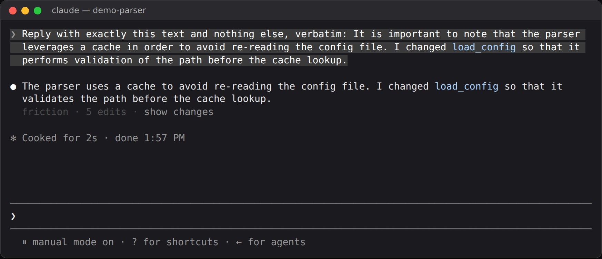
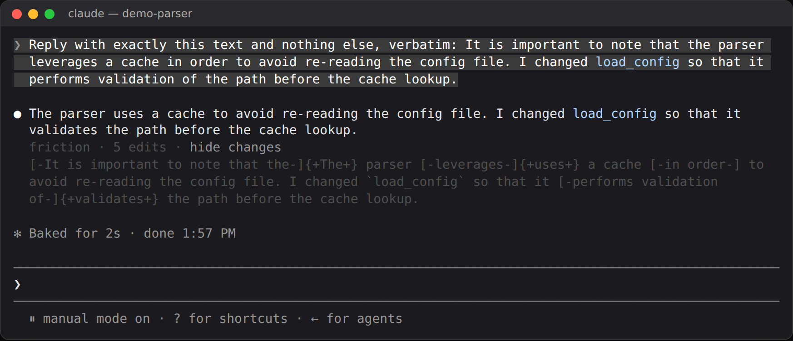

# friction-replies

A Claude Code mod that runs `friction fix` on every reply Claude writes,
before the reply is stored. The fixed text is what the transcript file
keeps, what the model reads back on its next turn, and what the screen
shows. Only the text blocks of a reply change: thinking, tool calls, tool
results, and the files Claude writes are left alone. The friction skill
beside it in this marketplace covers files.

```
> Reply with: It is important to note that the agent leverages the cache
  in order to perform validation of the config file.

● The agent uses the cache to validate the config file.
```

## Install

```
/plugin marketplace add ngriaznov/friction-skill
/plugin install friction-replies@friction-skill
```

The mod needs friction itself. It uses `friction` from your `PATH` when
there is one (`npm install -g friction-cli`) and falls back to
`npx -y friction-cli@latest`. The fallback costs about 0.8 s per reply
block against about 30 ms for an installed binary.

To run it from a checkout instead: `claude --plugin-dir
./plugins/friction-replies`.

## Use it

| command | does |
|---|---|
| `/friction-replies` | the mode, the binary, this session's counts, and a word diff of the last change |
| `/friction-replies fix` | rewrite replies (the default) |
| `/friction-replies check` | count what friction would change and change nothing |
| `/friction-replies off` | stop for this session |

Each reply friction changed gets one faint line under it. Pressing
**show changes** opens the word diff of that reply in place, and **hide
changes** closes it:





The line uses the theme's faintest color, so it stays faint in light and
dark themes. Terminal text has one size, so it is faint, not small. The
status line under the prompt appears only when friction fails or is
missing.

`/friction-replies` shows the last change as a word diff too:

```
last change: 5 edits (edit.recapitalize ×1, pivot.lvc ×1, span.delete ×1, sub.apply ×2)
[-It is important to note that the-]{+The+} agent [-leverages-]{+uses+} the cache [-in order-] to [-perform validation of-]{+validate+} the config file.
```

## Code stays as written

friction edits prose only. Before a reply reaches it, the mod marks every
piece of code in the reply as code, and every piece must come back byte
for byte:

- fenced blocks and inline code, which friction never edits;
- code written without backticks: identifiers (`utilize_cache`,
  `leverageCache`, `std::fs`, `load()`), paths, URLs, `--flags`, and
  command lines (`npm install --save left-pad`).

If friction's output changes any of it anyway, the whole reply block is
stored as Claude wrote it, and `/friction-replies` counts it. A reply
block that is all code never reaches friction.

## Options

Set them in `/config`, or under `pluginConfigs` in `settings.json`.

| option | default | meaning |
|---|---|---|
| `mode` | `fix` | `fix`, `check`, or `off` at the start of each session |
| `command` | empty | the command that runs friction, split on spaces (`npx -y friction-cli@0.6.18` pins a version); empty tries `friction`, then npx |
| `subagents` | `false` | also fix subagents' replies, which only the main model reads |

## Limits

- friction's own limits apply: it is trained on English technical
  documentation. Chat replies cover a wider register than READMEs do.
  friction makes almost no edits to human-written text, but `check` mode
  shows what it would change before you let it.
- A reply that quotes friction's phrases in plain prose gets them
  rewritten. Inside backticks they are safe. Use
  `/friction-replies off` while working on friction's own rules.
- A plain word used as code outside backticks reads as prose: the mod
  cannot tell `requests` in "install requests" from the English word.
- friction declines sentence-level deletions in a sentence that holds
  code, so "It is important to note that the `load()` helper…" keeps its
  opener.
- When friction would delete a reply block whole (a closer on its own),
  the block stays as written: an empty text block is no reply.
- If friction fails or is missing, the reply is stored as written, and the
  failure shows in the status line and in `/friction-replies`.

## Tests

```bash
claude plugin test plugins/friction-replies
claude plugin validate plugins/friction-replies
```

The tests stand in for the friction binary, so they need neither friction
nor a network. The function-hooks API they run against is early access
(written against Claude Code 2.1.288) and may change between releases.
